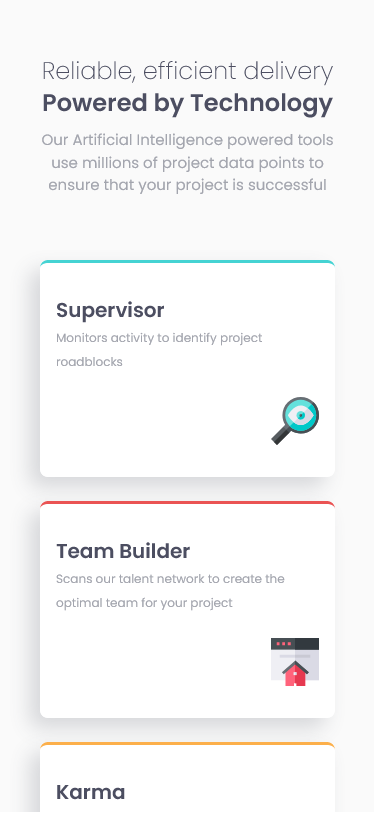
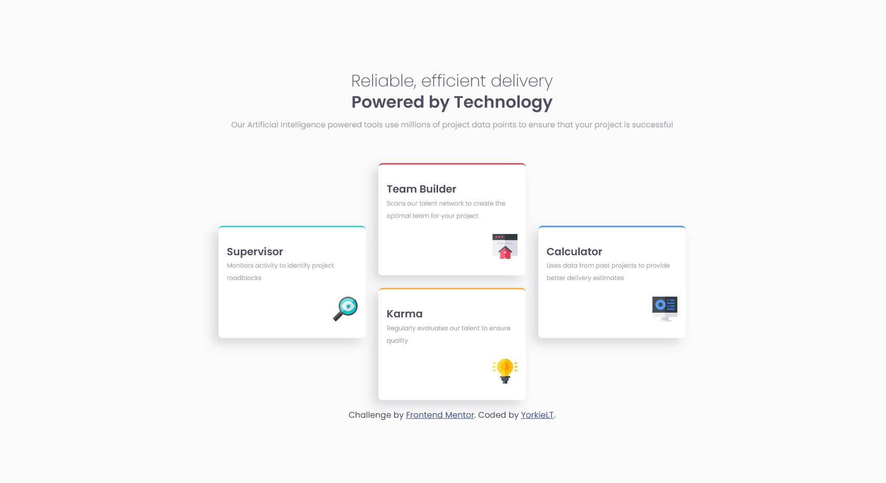

  

  <h1 align="center">Four Card Feature Solution</h1>
  

    <a href=https://www.frontendmentor.io/solutions/responsive-four-card-feature-section-using-css-gridflex-nFq-BlADAu><strong>Frontend Mentor Challenge</strong></a>
     
     
    <a href="https://zingy-griffin-5ccb4f.netlify.app/">View Demo</a>
    ·
    <a href="https://www.frontendmentor.io/solutions/responsive-four-card-feature-section-using-css-gridflex-nFq-BlADAu" target="_blank">Leave a comment</a>
  

<!-- Badges -->

  <!-- Profile -->
  
  <!-- Status -->
    

#

This is a solution to the [Four Card Feature Section challenge on Frontend Mentor](https://www.frontendmentor.io/challenges/four-card-feature-section-weK1eFYK). Frontend Mentor challenges help you improve your coding skills by building realistic projects.

<h2 align="center">Links</h2>

- Solution URL: [https://www.frontendmentor.io/solutions/responsive-four-card-feature-section-using-css-gridflex-nFq-BlADAu](https://www.frontendmentor.io/solutions/responsive-four-card-feature-section-using-css-gridflex-nFq-BlADAu)
- Live Site URL: [https://zingy-griffin-5ccb4f.netlify.app/](https://zingy-griffin-5ccb4f.netlify.app/)

 

## Table of contents

- [Overview](#overview)
  - [The challenge](#the-challenge)
- [My process](#my-process)
  - [Built with](#built-with)
- [What I learned](#what-i-learned)
- [Author](#author)

## Overview

### The challenge

Users should be able to:

- View the optimal layout depending on their device's screen size

## My process

I will start with the style-guide.md file. Then I will try to gauge what fonts were used in which areas awhile making my --custom properties.

I had fun making this project, at first I wanted to just try using only Grid but instead opted on Flex for mobile and then Grid for desktop.

I also got to try Prettier for the first time, I enjoy its formatting compared to VS Code's default formatter. :)

My first issue was when I was styling the cards, I noticed once I shrinked my width lower than `375px`, my header would cut off at the top and only half would show, this was an issue I have had before and I am not sure what is the best solution to do, it seems like an obvious reason but I have not had much luck when researching it.

My solution was to add `margin: 15rem` to the `body` but I can't tell if this is not good practice with how much it is and anyone seeing that makes their eye twitch!

For the border color, I noticed after researching how to achieve a top border color, some people use a pseudo element with positioning but I learned about the `border-top-color` property and it did what I wanted, granted the color leaks into the side-corners a tiny bit, I am not sure if there was a way to stop that. 

I also got to try a bit of `grid-area` too, I feel like I am not fully confident in utilizing grid as well as I want to, so this project has told me to do more research on all of grid's properties.

### Built with

<!-- Badges -->

- Semantic HTML5 markup
- Pure CSS3
- Visual Studio Code (Editor)

## What I learned

- Using `border-top-color` property
- Using `grid-area` property

## Author

- Frontend Mentor - [@YorkieLT](https://www.frontendmentor.io/profile/YorkieLT)
